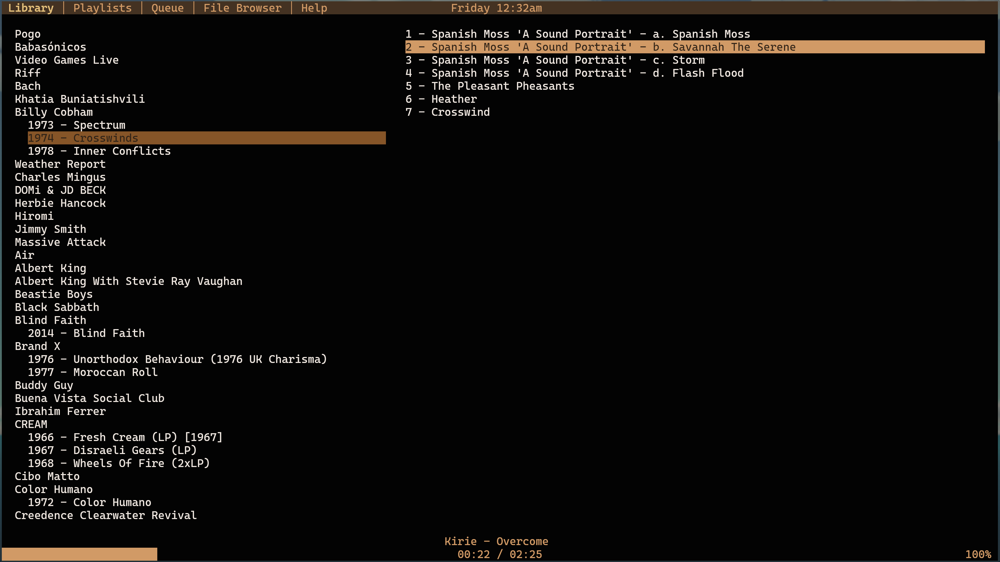
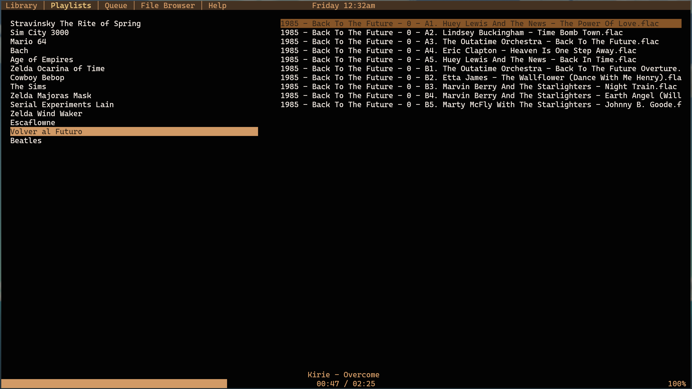
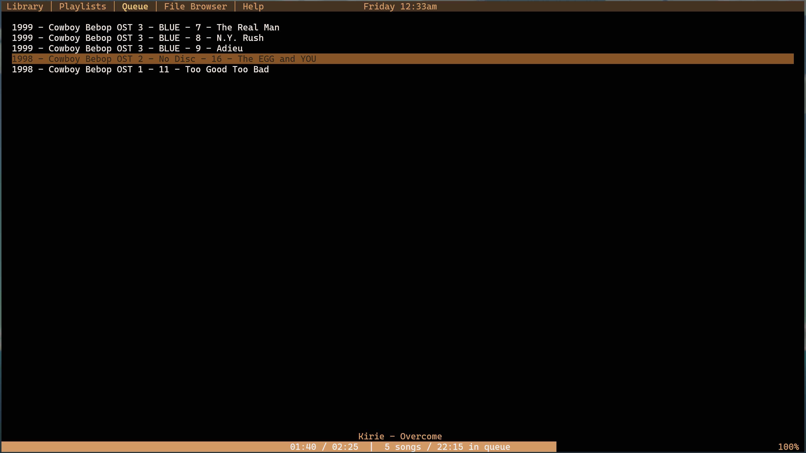
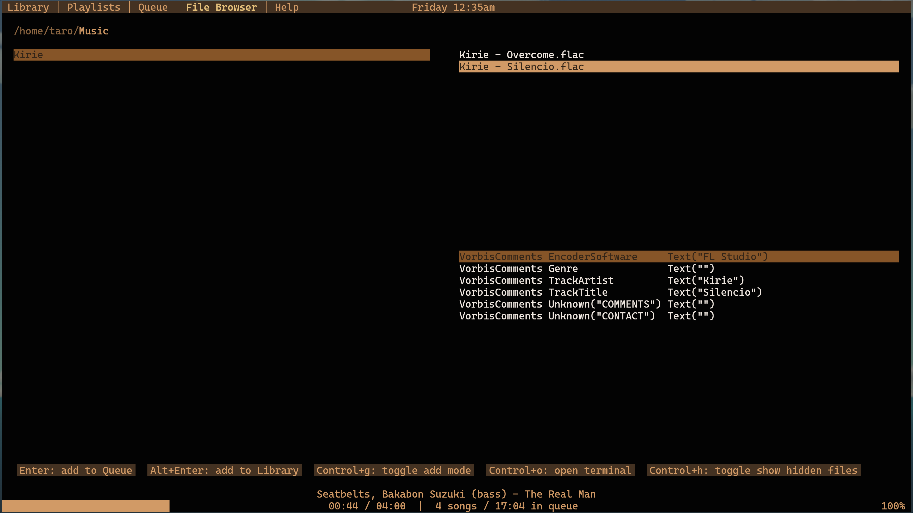

# Jolteon 

The best music player.

# Table of contents
1. [Installation](#installation)
1. [Screenshots](#screenshots)
1. [Features](#features)
1. [Upcoming Features](#upcoming)
1. [Supported Audio Formats](#supported-audio-formats)
1. [Performance](#performance)
1. [Philosophy](#philosophy)
1. [Developing](#developing)
1. [Bugs](#Bugs)

## Installation

### Binaries

Jolteon is available for Linux and MacOS (both Apple Silicon and Intel).

You should be able to just download the binary, `chmod +x jolteon`, and run it.

Run the following script to download the latest release for your platform:

Bash:
```
curl -s -o- https://raw.githubusercontent.com/lautarodragan/jolteon/refs/heads/main/get.sh | bash
```

Nushell:
```
http get https://raw.githubusercontent.com/lautarodragan/jolteon/refs/heads/main/get.nu | nu -c $in
```

Nushell, longer version:
```
let folder = mktemp --tmpdir --directory --suffix .jolteon
let file = $folder | path join "get.nu"
print $"Downloading Jolteon installation script to ($file)"
http get https://raw.githubusercontent.com/lautarodragan/jolteon/refs/heads/main/get.nu | save $file
^$file
```

Or…
- See [releases](https://github.com/lautarodragan/jolteon/releases) for published releases and nightly builds.
- See the [release workflow](https://github.com/lautarodragan/jolteon/actions/workflows/cd.yml) run history for binaries built automatically for every commit to `main`.

### Cargo

```
cargo +nightly install jolteon
```

### From Source

```
git clone --depth=1 https://github.com/lautarodragan/jolteon.git
cd jolteon

cargo install --path .
```

On Linux, you may need to install the ALSA lib dev package.

```
# Arch
sudo pacman -S alsa-lib

# Ubuntu
sudo apt-get install libasound2-dev
```

## Screenshots

<details>
<summary><strong>Screenshots (Opaque)</strong></summary>






</details>

<details>
<summary><strong>Screenshots (Transparent)</strong></summary>


</details>

## Features

Jolteon offers the standard features you'd expect of a music player: a library, playlists, playing queue and a file browser,
a status indicator, and supports cue sheets and media keys. 

It also offers some special features that no other player has.

Let's start with the basics. These are the main actions and their default key bindings:

| Key                                         | Action                                                |
|---------------------------------------------|-------------------------------------------------------|
| <kbd>Tab</kbd>                              | Cycles through focusable elements in the screen.      |
| <kbd>1</kbd>                                | Select Library                                        |
| <kbd>2</kbd>                                | Select Playlists                                      |
| <kbd>3</kbd>                                | Select Queue                                          |
| <kbd>4</kbd>                                | Select FileBrowser                                    |
| <kbd>5</kbd>                                | Select Help                                           |
| <kbd>Ctrl</kbd> + <kbd>Space</kbd>          | Toggle play/pause                                     |
| <kbd>+</kbd>                                | Increase volume                                       |
| <kbd>-</kbd>                                | Decrease volume                                       |
| <kbd>Ctrl</kbd> + <kbd>Left</kbd>           | Seek backwards 5s                                     |
| <kbd>Ctrl</kbd> + <kbd>Right</kbd>          | Seek forwards 5s                                      |
| <kbd>Alt</kbd> + <kbd>Q</kbd>               | Repeat: None (Turn Off)                               |
| <kbd>Alt</kbd> + <kbd>W</kbd>               | Repeat: One Song                                      |
| <kbd>Alt</kbd> + <kbd>E</kbd>               | Repeat: Entire Queue                                  |
| <kbd>Alt</kbd> + <kbd>R</kbd>               | Repeat: Toggle                                        |
|                                             |                                                       |
|                                             | **Library Screen**                                    |
| Any letter key                              | Search                                                |
| <kbd>Alt</kbd> + <kbd>↓</kbd>               | Next artist                                           |
| <kbd>Alt</kbd> + <kbd>↑</kbd>               | Previous artist                                       |
| <kbd>Ctrl</kbd> + <kbd>↓</kbd>              | Reorder album inside artist                           |
| <kbd>Ctrl</kbd> + <kbd>↑</kbd>              | Reorder album inside artist                           |
| <kbd>Ctrl</kbd> + <kbd>Del</kbd>            | Remove album from library                             |
| <kbd>↓</kbd>                                | While Searching: Select Next Result                   |
| <kbd>↑</kbd>                                | While Searching: Select Previous Result               |
| <kbd>Esc</kbd>                              | While Searching: Exit search mode                     |
| <kbd>Enter</kbd>                            | While Searching: Exit search mode + play selection    |
| <kbd>Space</kbd>                            | Collapse or expand selected artist                    |
| <kbd>(</kbd>, <kbd>Alt</kbd> + <kbd>9</kbd> | Collapse all artists                                  |
| <kbd>)</kbd>, <kbd>Alt</kbd> + <kbd>0</kbd> | Expand all artists                                    |
|                                             |                                                       |
|                                             | **Playlist Screen**                                   |
| <kbd>F8</kbd>                               | Open/Close Playlist Graveyard                         |
| <kbd>Enter</kbd>                            | Add Selected Song / Playlist to Queue                 |
| <kbd>Alt</kbd> + <kbd>Enter</kbd>           | Play Selected Song / Playlist immediately             |

The key bindings are configurable.

To see the full list of default key bindings, you can run `jolteon print-default-key-bindings`
or see [actions.ini](assets/actions.ini).

Custom key bindings are read from `~/.config/jolteon/actions.ini`.
You can `jolteon print-default-key-bindings > ~/.config/jolteon/actions.ini` to get started.

Inside Jolteon, the Help screen shows the active key bindings (default + custom overrides).

> [!TIP]
> Some Jolteon key bindings may conflict with the terminal's ones.
> Modern terminal emulators support options to disable all key binds, leaving them all available to Jolteon:
> 
> `kitty -o "clear_all_shortcuts yes" jolteon`  
> `ghostty --keybind=clear -e jolteon`  
> `wezterm --config disable_default_key_bindings=true -e jolteon`  
> 
> This is particularly useful when launching from a .desktop file:
> 
> `Exec=kitty --class "jolteon" -o "clear_all_shortcuts yes" jolteon`

### `.jolt` files

It's pretty common for media files to have incorrect or inconsistent metadata.
Traditionally, there are two solutions to this problem:
- Avoid the media library altogether, and just browse files
- Modify the metadata in the files with some program

Jolteon offers a better alternative: overriding metadata non-destructively via `.jolt` files.

Just place a `.jolt` file along the media files and Jolteon will read it when adding them to the library. 

```
album = "Album Name Override"
artist = "Artist Name Override"
year = 2000
```

All keys are optional.

> [!NOTE]
> Currently, there is no way to re-scan metadata after something is added to the library.
> If you change something in the `.jolt` file, you'll need to remove the tracks / albums
> from the library and re-add them for the changes to be picked up.

### CLI Mode

Jolteon can also run in non-interactive mode.

| Subcommand                 | Description                               |
|----------------------------|-------------------------------------------|
| play                       | Play a media file in non-interactive mode |
| print-default-config       | Print the default configuration           |
| print-default-key-bindings | Print the default key bindings            |
| cue                        | Parse cue sheet files                     |
| tags                       | Print a media file's tags                 |

Run `jolteon help` to see available commands and arguments.

The subcommand is optional, and defaults to `play`, so you can just `jolteon <file.flac>` to quickly
play a song in non-interactive mode.

> [!TIP]
> `jolteon cue <file.cue> --output json` can be particularly useful for scripts!
> It can be piped into `jq` or `from json` for further processing.
> For example, with nushell:
> 
> ```
> » ls **/*.cue | take 2 | get name | each { jolteon cue -o json $in | from json | $"($in.performer): ($in.title)" } | str join "\n" 
> Artist 1: Awesome Album
> Artist 2: Cool Album
> ```

### Other Features

- A clock on the top bar. Can be turned off via configuration.
- View file metadata / tags and cue sheet details in File Browser
- Status Persistence
  - The queue is persisted when the application closes. If you close Jolteon with tracks in the queue, when you come back, it'll
    start playing the next automatically.
  - Modifications to the library are saved instantly, not when the application closes. If the application is shut down abruptly, you won't lose data.
  - The current directory in File Browser is persisted when the application closes. You can close Jolteon, come back, and pick up where you left off. 
- Focus on stability
- Portability
  - The entire library is just one big JSON file, and configuration and state files are TOML files. This makes it easy to back them up, modify them manually, and even use `git` to track changes to them.

### Upcoming

<details>
<summary><strong>Media Library Improvements</strong></summary>

- Automatic sorting
- Search for song through entire library

</details>

<details>
<summary><strong>File Browser Improvements</strong></summary>

- Bookmarks
- When adding an entire folder, scan folder for `.cue` files and offer using the cue sheet rather than adding individual tracks from the folder.

</details>

<details>
<summary><strong>Playlist from Library</strong></summary>

Currently, files can _only_ be added to playlists from the file browser. Support to do so from the Library is coming soon.

</details>

<details>
<summary><strong>Communication, Feedback & Notifications</strong></summary>

If any non-bug causes an issue, rather than just being ignored, it'll be communicated in a status area.
For example: a file that cannot be played correctly, for whatever reason.

Same goes for performed actions ("Added X to library", for example).

</details>

<details>
<summary><strong>Theme Customization</strong></summary>

Status: partially implemented; almost complete.

- There will be some way to switch themes programmatically from outside the application, for themes to be switchable by external scripts.
- Integration with OS light/dark mode will be added. Which theme is associated with each mode will be configurable, but have a sensible default.
- See [assets/gruvbox_dark.toml](assets/gruvbox_dark.toml)

</details>

<details>
<summary><strong>Playlist Graveyard</strong></summary>

Status: partially implemented

- Deleted playlist are soft-deleted, not truly deleted. 
- The playlist graveyard can be opened and closed with <kbd>F8</kbd>.
- The playlist graveyard cannot be focused or used at all, right now. Just opened to see it, and closed. In the future, it'll be properly
  interactive, allowing un-deleting playlists, and maybe hard-deleting.

</details>

<details>
<summary><strong>Persist Currently Playing Track</strong></summary>

The currently playing song and its position will be persisted too, so, rather than to start playing 
the next song, it'll start playing the same song at the position it was when Jolteon was closed.

</details>

<details>
<summary><strong>Gapless playback</strong></summary>

Cue sheet tracks are handled as if they were individual files. If playing 2 consecutive tracks from a single Cue sheet,
when track A finishes playing, Jolteon will still close the file, open it again, and seek to the starting time of track B.
This basically defeats the gapless playback we get for free from Cue sheet files. In the future, this case will be handled specifically,
to take advantage of it and just keep playing the same audio file.

True gapless playback between different files is a different challenge. Latency is addressed by buffering two files at once
rather than just one, and, roughly speaking, chaining the decoding iterators. We may still wind up with undesired pauses or audible artifacts
between songs. Ideally, for gapless playback, we should always try to have a single, big audio file for the entire album, with its Cue sheet.

</details>

<details>
<summary><strong>Automatic updates</strong></summary>

Partially implemented. The app checks for new GitHub releases when launched, and detects new versions,
but doesn't yet download the published binary.

</details>

<details>
<summary><strong>Virtual directories in media library</strong></summary>

Displaying music by artist, album, track number and song title is generally more desirable than navigating the file system, but, sometimes, being able
to manually structure and organize music beyond its metadata is convenient.

Personally, I prefer having all soundtracks under an `OST` folder, rather than mixed with bands. Same goes for "classic" music, or _interpreted_ music in general (as opposed to original compositions).

There's no real reason not to support both approaches at once, by organizing music files by metadata but allowing grouping by _virtual directories_, which would enable things like:
- _Interpreted_
  - Bach
- _Modern_
  - The Doors
  - Pink Floyd
    - The Piper at the Gates of Dawn 
    - The Dark Side of the Moon
    - Wish You Were Here
- _Soundtracks_
  - _Cowboy Bebop_
  - _Ry Cooder - Crossroads_

</details>

<details>
<summary><strong>Album Covers</strong></summary>

Kitty supports full-resolution, full-color images. It shouldn't be particularly hard to add this feature.

I'll have to figure out the best UI and UX for this, and probably make it optional/configurable.

</details>

## Configuration Options

| Setting             | Type                                      | Default       | Description                                              |
|---------------------|-------------------------------------------|---------------|----------------------------------------------------------|
| clock_display       | boolean                                   | true          | Whether or not to display the clock                      |
| paused_animation    | boolean                                   | true          | Whether or not to animate the PAUSED indicator           |
| theme               | "GruvboxDark" or "GruvboxDarkTransparent" | "GruvboxDark" | Choose one of the two built-in themes                    |
| debug_frame_counter | boolean                                   | false         | Debugging option. Displays a frame counter on the screen |

See [src/settings.rs](src/settings.rs) for more. The `struct Settings` has all the configuration options,
and default values are set with `serde_inline_default` (for example, `#[serde_inline_default(true)]`).

> [!NOTE]
> `GruvboxDarkTransparent` is literally `GruvboxDark` with a transparent background.
> This is particularly useful if you set the opacity of the terminal to anything other than fully opaque,
> since it'll allow seeing your wallpaper behind Jolteon.

> [!TIP]
> In Hyprland and Kitty, try the following:
> 
> ```
> # Hyprland
> decoration {
>   blur {
>     enabled = true
>     size = 3
>     passes = 1
>     vibrancy = 0.1696
>   }
> }
> 
> # Kitty
> background_opacity 0.6
> map f5 set_background_opacity -0.1
> map f6 set_background_opacity +0.1
> ```

## Supported Audio Formats

The following formats should work: `aac`, `flac`, `mp3`, `mp4`, `m4a`, `ogg`, `wav`.

<details>
<summary>Codec Issues?</summary>

Jolteon uses Rodeo to play music, with the symphonia backend. 

I mainly use `flac` files, and some `mp3`. Other formats aren't usually tested.

So far, I've only found _one_ issue with _one_ flac file, which fails to perform seeks, and, after a few seconds of playback, causes the cpal thread to panic, crashing Jolteon. 
This same file does run well with `mpv`. It does report errors reading it, but it still recovers well from them, and is able to seek without issues.

I tried switching the flac backend, but got even worse results. I looked into using [libmpv](https://github.com/mpv-player/mpv-examples/tree/master/libmpv) and [libavcodec](https://www.ffmpeg.org/libavcodec.html), which, in my mind, are pretty much guaranteed to be more stable, but switching to them is far from trivial.

Figuring out the specific bug in the flac codecs built in pure Rust is probably an easier and more reasonable path forward.

And Jolteon shouldn't crash if the audio playback crashes, but that's a story for another day.

</details>

## Performance

tl;dr: is good

<details>
<summary>longer explanation</summary>

I don't benchmark Jolteon, but I do use it many hours, every day, and the release build always stays at .5% of my CPU, and usually 25MiB of RAM.
I manually compare this to `mpv` (with `--no-audio-display`) and Jolteon usually consumes about the same CPU and significantly less RAM.

I haven't experienced any issues with the audio performance itself, but this is handled by symphonia and cpal, so there isn't a lot Jolteon can do to break it.
Same goes for the UI, which is managed by Ratatui.

I keep it open for days at a time — sometimes, even over a week, and haven't
seen it crash or increase memory usage.

If you do experience any sort of performance issues — be it choppy UI, keyboard input response, choppy audio, or significantly higher CPU/RAM usage than `mpv` or any other well-known media player
for the same file, please open an issue reporting it. Being able to reproduce this with an audio file available in the public domain, or with a license that permits sharing it, would be ideal,
even if hard or very unlikely.

</details>

## Philosophy

- Support features, UI and UX similar to `cmus`
- Statically linked, dependency free, single file binary that anyone can just download, `chmod a+x` and run.

### History & Rant

See [HISTORY.md](docs/HISTORY.md).

## Developing

See [DEVELOPING.md](docs/DEVELOPING.md)

## Bugs

See [BUGS.md](docs/BUGS.md).
